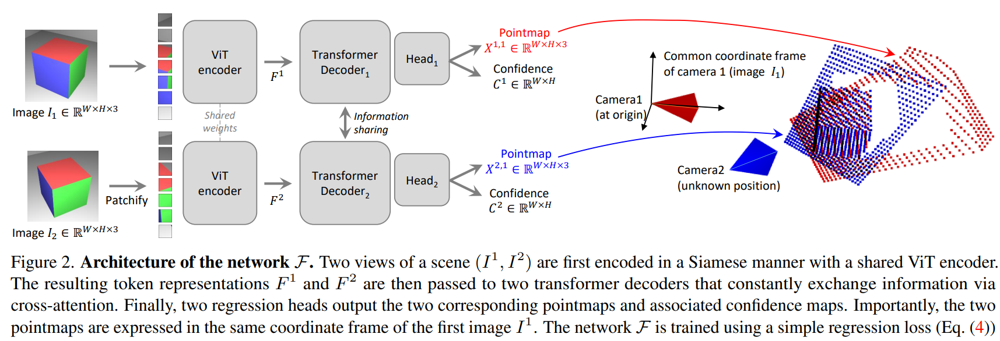

# DUSt3R

[DUSt3R](https://github.com/naver/dust3r)은 네이버랩스에서 개발한 모델로 2D를 3D로 변경해주는 AI도구입니다.
Transfomer의 encordor과 decoder을 사용하여 개발되었습니다.

논문 introduction의 suummary를 보면 4가지의 이점에 대해 소개합니다.

1. End-To-End 3D reconstruction
2. pointmap representation for MVS applications
3. optimization procedure to globally align pointmaps
4. performance on a range of 3D vision tasks

연관된 기술에는 SFM, MVS, Direct RGB-to-3D, Pointmaps 등이 있습니다.

**SFM**

Structure From Motion의 약자로 동일한 객체를 다른 시점에서 중첩되도록 찍은 Multi-view 이미지들로 부터 3D Structure와 Camera pose를 복원하는 프로세스이다.

- 4가지 조건이 잘 충족되지 않으면 3D reconstruction결과가 좋지 않음.

**MVS**

Multi-view stereo의 약자로 서로 다른 시점을 가진 2개 이상의 이미지를 이용해 해당 이미지에 나타나는 물체들의 3D 표면을 복원하는 프로세서입니다.

## Method

과정을 보면 가장 먼저 pointmap의 경우
3D point의 2D filed dense를 포인트맵으로 나타내는 데 다음과 같습니다.

$$ X ∈ R^{W×H×3} $$

해상도 W × H 이미지(I)에 대해 X는 이미지 픽셀과 3D 점 사이의 일대일 매핑을 형성합니다.

$$ Ii,j ↔ Xi,j $$

모든 픽셀 좌표에 대해

$$ (i, j) ∈ {1 . . . W} × {1 . . . H} $$

으로 나타낼 수 있습니다.

- 여기서 각 카메라 광선이 모든 3D포인트에 도달하는 것을 가정으로 진행. 불투명한 표면의 경우는 무시됨.

camera의 경우

$$ K ∈ R^{3×3} $$

으로 주어지고
Depthmap(D)에 대해

$$ D ∈ R^{W×H} $$

으로 가정하면

관찰된 장면에 대한 포인트맵 X에 대해 아래처럼 구할 수 있습니다.

$$ Xi,j = K^{−1} [iD_{i,j} , jD_{i,j} , D_{i,j}]^⊤ $$

- 여기서 X는 카메라 좌표계로 표현.

카메라 m의 좌표계로 표현된 카메라 n의 pointmap $X^n$을 $X^{n,m}$으로 나타내고 수식(1)으로 정리하면 아래와 같습니다.

$$ X^{n,m}=p*{m}p^{-1}*{n}h(X^n) \ \ (1) $$

추가로 $p_m,p_n ∈ R^{3×4}$를 사용하면 이미지 $n,m$에 대한 world-to-camera pose을 취하고

$$ h : (x,y,z) → (x, y, z, 1) $$

위 수식으로 동종 매핑이 수행됩니다.

## Overview

direct regression을 통해 generalized stereo case에 대한 3D reconstruction 작업을 수행하는 네트워크를 구축합니다.

- direct regression: DCNN 등의 네트워크 모델을 통해 신체 부위의 키포인트 위치를 직접 피팅(regression)하는 방법.

네트워크 구축을 위해 RGB이미지 $I_1,I_2 ∈ R^{W×H×3}$을 input으로 사용하고 결과로 연관된 confidence map $C^{1,1},C^{2,1} ∈ R^{W×H}$와 함께 2개의 해당 point map $X_{1,1},X_{2,1} ∈ R^{W×H×3}$을 출력합니다.

- 위 두 point map의 경우 $I_1$의 동일한 좌표계로 표현됨.
- 명확성과 일반화를 유지하기 위해 두 이미지의 해상도는 동일하다고 가정하지만 실제로는 해상도가 다를 수 있음.

Network architecture의 경우 [CroCo](https://croco.europe.naverlabs.com/public/index.html) 모델을 참고하여 구축하였습니다.  

사진을 보면 각각 이미지 encodor, decoder 및 회귀 헤드로 구성된 두개의 동일한 branch(각 이미지 당 하나씩)로 구성됩니다.

2개의 input이미지는 먼저 동일한 가중치를 공유하는 ViT 인코더로 인코딩되어 2개의 token representation(토큰 표현) $F_1,F_2$를 생성하고 다음과 같습니다.

$$ F^1 = Encoder(I^1),\ F^2 = Encoder(I^2) $$

그 다음 단계에서는 위 결과를 가지고 디코더를 통해 공동으로 추론합니다.
디코더의 경우 CroCo와 마찬가지로 cross attention기능을 갖춘 generic transformer network입니다.
따라서 각 디코더 블록은 순차적으로 self-attention(뷰의 각 토큰이 동일한 뷰의 토큰에 참여)을 수행한 다음 교차 어텐션(뷰의 각 토큰이 다른 뷰의 다른 모든 토큰에 참여)을 수행하고 마지막으로 토큰을 MLP(Multi-Layer Perceptron)에 공급합니다.

- 중요! 디코더를 통과하는 중에 두 branch간에 정보는 지속적으로 공유됨.
  ; 정렬된 point map을 출력하는 데 중요.

B블록이 있고 인코더 토큰 $G^1_0:= F^1 \ and \ G^2_0:= F^2$으로 초기화 되었는 디코더의 경우 각 디코더 블록은 다른 branch의 토큰에 참여합니다.

$$G^1_i = DecoderBlock^1_i(G^1_{i−1}, G^2_{i−1}), G^2_i = DecoderBlock^2_i(G^2_{i−1}, G^1_{i−1}) \ ( \ *for \ i = 1, . . . ,B)$$

- 여기서 $DecoderBlock^v_i(G^1,G^2)$는 $v ∈ {1, 2}$ 분기의 i 번째 블록을 나타내며, $G^1$ 및 $G^2$는 입력 토큰이고 $G^2$는 다른 branch의 토큰입니다.

마지막 과정으로 각 branch에서 별도의 회귀헤드가 디코더 토큰 세트를 가져와 포인트맵과 관련된 신뢰도 맵을 출력합니다.

$$ X^{1,1}, C^{1,1} = Head^1(G^1_0, . . . , G^1_B), $$
$$ X^{2,1}, C^{2,1} = Head^2(G^2_0, . . . , G^2_B) $$

## Discussion

위 과정을 통해서 output pointmap $X^{1,1}, X^{2,1}$을 얻었지만 알 수 없는 축척 비율까지 회귀되는 문제가 발생합니다. 또한 현재 아키텍처는 어떠한 기하학적 제약도 명시적으로 적용하지 않는다는 점을 유의해야 합니다. 따라서 포인트 맵은 물리적으로 그럴듯한 카메라 모델과 반드시 일치하는 것은 아닙니다. 오히려 네트워크가 기하학적으로 일관된 포인트맵만 포함하는 학습세트에 존재하는 모든 관련 사전 정보를 학습하도록 합니다. 일반 아키텍쳐를 사용하면 강력한 사전 학습 기술을 활용하여 궁극적으로 기존 작업별 아키텍처가 달성할 수 있는 수준을 능가할 수 있습니다. 세부적인 내용을 다음 내용에서 다룹니다.

## Training Objective

### 3D Regression loss. 
DUSt3R 모델의 학습 목표는 3D공간에서의 회귀를 기반으로 합니다. 실측 포인트 맵을 ${\bar{X}}^{1,1}$과 $\bar{X}^{2,1}$로 표시하겠습니다. 이는 실측이 정의된 2개의 vaild pixel $D^1, D^2 \subseteq {1 . . . W} × {1 . . . H}$와 함께 Eq.(1)에서 얻은 것 입니다.

valid pixel $i ∈ D^v$에 대한 회귀 손실$v ∈{1, 2}는 유클리드 거리를 통해 구할 수 있습니다.
$$ℓ_{regr}(v, i)= \left\|\left\|\frac{1}{z}X^{v,1}_i- \frac{1}{z}\bar{X}^{v,1}_i \right\|\right\| \ \ (2)$$

예측과 원본 데이터사이의 scale ambiguity을 처리하기 위해, 배율인수 $z = nor(X1,1, X2,1)$ 과 $bar{X} = norm(X¯ 1,1, X¯ 2,1)$ 을 사용하여 예측 및 실측 포인트 맵을 정규화합니다.
이는 각각 원점까지의 모든 유효한 지점의 평균 거리를 나타냅니다. 
$$norm(X^1, X^2) = \frac{1}{|D1| +|D2|}\sum_{v∈{1,2}}\sum_{i∈D^v}∥X^v_i∥ \ \ (3)$$

## Confidence-aware loss.
실제로는 논문에서 가정한 상황과 달리 반대로 잘못 정의된 3D 포인트가 있습니다. (예를 들어 하늘이나 반투명한 물체) 
보다 일반적으로 이미지의 일부 부분은 일반적으로 다른 부분을 예측하기가 더 어렵습니다.
따라서 우리는 네트워크가 이 특정 픽셀에 대해 갖는 신뢰도를 나타내는 각 픽셀의 점수를 예측하는 방법을 공동으로 학습합니다.
